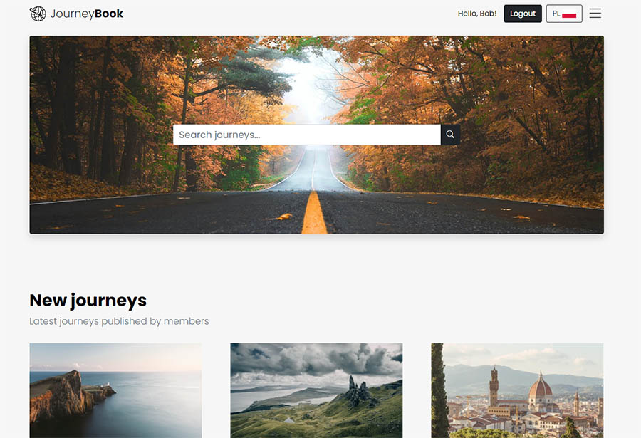

# JourneyBook

A simple social media website built using the MERN stack (MongoDB, Express, Node.js, React). It allows the user to create a travel-themed blog. Inspired by TripAdvisor. 

## Site

Here is a link to the site: [https://journey-book.web.app/](https://journey-book.web.app/)

## Table of contents
* [General description](#general-description)
* [Technologies](#technologies)
* [Features](#features)
* [Setup](#setup)

## General description

The purpose of the app is to provide a simple tool to set up your own travel blog, as well as browse other author's blogs. Your blog's content is divided into journeys, each of which can contain multiple posts and reviews.

Travel blogs remain one of the most valuable sources of information in planning your journey, or just daydreaming about one. 
Unlike a review-centered site (ex. TripAdvisor, Yelp) they provide a space for longform content that allows you to connect to an author whose writing style you enjoy and whose interests you share.

## Technologies

Project is created with:

### Frontend:

* React.js - frontend framework
* Redux Toolkit - efficient tool for app-wide state management
* Mapbox - maps and geocoding features
* Formik + Yup - forms and client-side data validation
* Bootstrap + React Bootstrap - CSS framework and a library of ready-made components
* React Masonry Component - responsive masonry
* i18next - internationalization framework

### Backend:

* Node.js + Express - backend framework
* MongoDB + Mongoose - popular NoSQL database
* JWT + Bcrypt.js - user authentication
* Cloudinary + Multer - image upload and cloud storage
* Joi - server-side data validation
* Helmet.js - security

## Features

* Create user account and customize your blog page
* Create, update and delete journeys, posts and reviews
* Browse other users' blogs and add their content to favorites
* Upload images or add free images from Unsplash
* Use geocoding and maps to show locations you write about
* Switch between English and Polish language

## Setup

After you clone this repo to your desktop, go to its root directory and run `npm install` to install its dependencies.

Once the dependencies are installed, you can run `npm start` to start the application. You will then be able to access it at localhost:3000.

You have to provide your own values for .env variables REACT_APP_MAPBOX_KEY and REACT_APP_UNSPLASH_KEY for the maps and image search to work.

